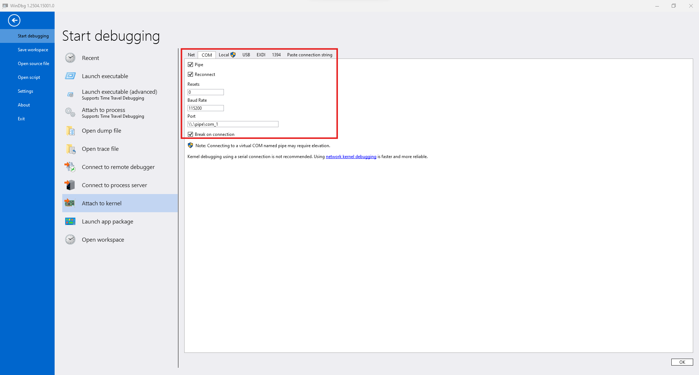
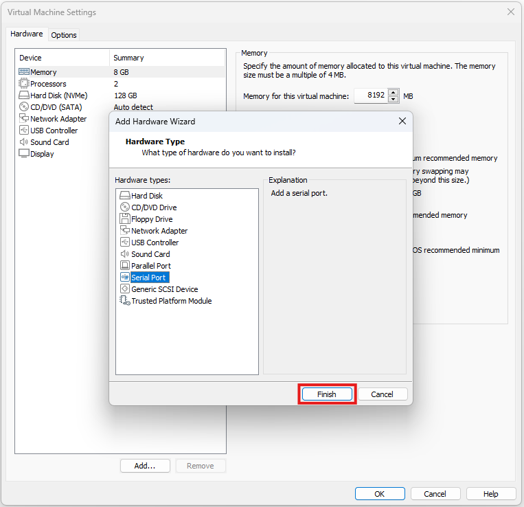

+++
title = "윈도우 커널 디버깅"
date = "2025-04-25"
description = "WinDbg + VMware를 이용한 윈도우 커널 디버깅"

[taxonomies]
tags = ["tools", "windows kernel", "windbg"]

[extra]
toc_levels = 2
+++

## 0x00. Introduction
Windows 커널을 분석하기 위한 환경을 구축하고 유용한 명령어를 정리한 포스트이다.


## 0x01. Setup
### Host(Debugger)
예전에는 Windows SDK, Virtual KD 등 편의성을 위해 설치 과정이 복잡했었는데, 이제는 WinDbg가 정식 출시되며 많이 간단해졌다.
Microsoft Store에 가서 WinDbg를 설치하고 실행하면 끝이다.

상단 메뉴의 File -> Start Debugging -> Attach to kernel에서 COM을 선택한 뒤 다음과 같이 설정한다.



설정을 완료하고 오른쪽 하단의 "OK"를 누르면 디버깅 대기 상태에 들어간다.

### Guest(Debuggee)
디버깅 대상은 다양한 프로그램을 통해 구축할 수 있는데 이번 포스트에서는 VMware를 통해 구축한 경우 설정 방법에 대해 기술한다.

먼저 대상 vm을 켜고 powershell을 관리자 권한으로 실행한 후 다음 명령을 실행한다.

```
bcdedit /debug on
bcdedit /dbgsettings serial debugport:1 baudrate:115200
```

이후 vm을 종료하고 상단 메뉴에서 VM -> Settings -> Add를 선택해서 Serial Port를 추가한다.



추가된 Serial Port를 다음과 같이 설정한다.
참고로 "The other end is an application"이 아닌 "The other end is a virtual machine"을 선택해도 연결은 되는 것 같다.


마지막으로 대상 vm을 실행해주면 host와 연결된다.


## 0x02. Commands
### Modules
#### `lm` (List Modules)
로드된 모듈을 출력하거나 특정 모듈의 정보를 확인할 수 있다.

``` windbg
kd> lm
kd> lm m fltmgr
kd> lm Dvm fltmgr
```

참고로 kernel mode 영역은 `fffff800'00000000`같이 높은 주소에 로드된다.

#### `x` (eXamine symbols)
심볼을 탐색하거나 특정 심볼을 찾는다.

``` windbg
kd> x win32k!
kd> x win32k!vStr*
```

### Symbols
#### `!sym noisy` (Noisy symbol loading)
심볼 로딩 과정을 자세하게 출력한다. 로딩 관련 문제가 있을 때 디버깅하기 좋다.

``` windbg
kd> !sym noisy 
```

#### `!sympath` (Set symbol path)
심볼 서버 또는 로컬에 심볼 파일들이 저장된 경로를 설정한다.

``` windbg
kd> !sympath SRV*C:\symbols*https://msdl.microsoft.com/download/symbols
kd> !sympath C:\symbols 
```

#### `.reload` (Reload symbols)
심볼을 다시 로드한다. `/f` 옵션을 주면 강제로 심볼을 로드한다.

``` windbg
kd> .reload
kd> .reload /f CLFS
```

### Memory
#### `db` `dw` `dd` `dq` (Display memory)
메모리를 각각 byte, word, double word, quad word 단위로 출력해준다.
뒤에 `L[Length]`를 입력해서 출력할 개수를 지정하거나, 출력할 마지막 주소를 입력해서 범위를 지정할 수 있다.
혹은 레지스터 이름을 입력해서 레지스터에 저장된 값을 읽어와 사용할 수도 있다.

``` windbg
kd> db [Address]
kd> dw [Address] L[Length]
kd> dd [Address] [Address]
kd> dq rsp
```

#### `ds` `du` `dc` (Display string)
메모리를 각각 ascii, unicode 문자열로 출력해준다.
`dc`의 경우 hex 값과 문자열을 동시에 출력해준다.

``` windbg
kd> ds [Address]
kd> du [Address]
```

#### `dps` (Display Pointers and Symbols)
메모리에 저장된 포인터를 심볼 정볼르 기반으로 해석해서 출력해준다.

``` windbg
kd> dps [Address]
```

#### `u` `ub` `uf` (Unassemble)
메모리 안에 있는 명령어를 어셈블리로 해석해서 출력해준다.
기본적인 `u`를 어셈블리 코드를 입력한 주소의 역방향으로 출력해주는 `ub`와 같이 쓰면 앞뒤 instruction을 한번에 볼 수 있어서 편리하다.

`uf`는 함수 전체를 출력해주는데, 함수의 처음이 아니라 중간 아무 위치나 입력해도 된다. 단, 심볼이 잘 로딩되어 있어야 한다.

``` windbg
kd> u rip
kd> ub rip
kd> uf [Address]
```

### Information
#### `analyze -v` (Analyze crash dump)
Crash가 발생했을 때 대략적인 원인과 레지스터들의 상태 등 다양한 정보를 출력해준다.

``` windbg
kd> !analyze -v
```

#### `k` `kv` (Stack trace)
현재 쓰레드의 call stack을 출력한다. `kv` 명령어의 경우 전달된 인자의 값을 함께 출력해준다.

``` windbg
kd> k
kd> kv 
```

#### `!process` `!thread` (Process / Thread information)
프로세스의 정보를 출력해준다. `!process` 단독으로 사용했을 때 현재 프로세스의 정보를 자세하게 출력해주고, 뒤에 `0 0`을 추가하면 모든 프로세스의 정보를 간단하게 출력해준다. 특정 프로세스의 정보를 확인하고 싶을 때는 해당 프로세스의 주소를 입력해주면 된다.

`!thread`는 쓰레드의 정보를 출력해주는데, 단독으로 사용했을 때 현재 쓰레드의 정보를 출력해주고, 특정 쓰레드의 주소를 입력하면 해당 쓰레드의 정보를 출력해준다.

``` windbg
kd> !process
kd> !process 0 0
kd> !process [Address]
kd> !thread
kd> !thread [Address]
```

### Debug
#### `bp` `ba` (Break Point)
지정한 주소나 심볼을 실행할 때 흐름을 멈추는 명령이다. `ba` 명령어를 이용하여 특정 메모리를 읽기 / 쓰기 / 실행할 때 멈추도록 할 수도 있다.
``` windbg
kd> bp 0x401000
kd> bp ntdll!NtCreateFile
kd> ba [r/w/x/rw][Length] [Address]
```

#### `p` `t` `pt` `g` `pc` (Flow control)
다음 명령어를 실행하는 `p`(`ni`), 다음 명령어를 실행하되 함수라면 내부로 진입하는 `t`(`ni`), 함수가 끝날 때까지 실행하는 `pt`, 다음 브레이크 포인트까지 실행하는 `g`, 특정 주소까지 실행하는 `pc`등 다양한 디버깅 흐름 제어 명령어들이 있다.

``` windbg
kd> p
kd> t
kd> pt
kd> g
kd> pc [Address]
```