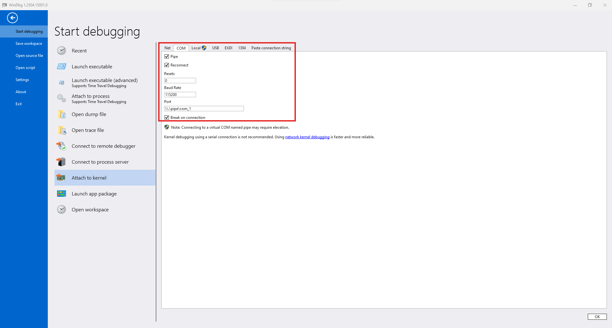
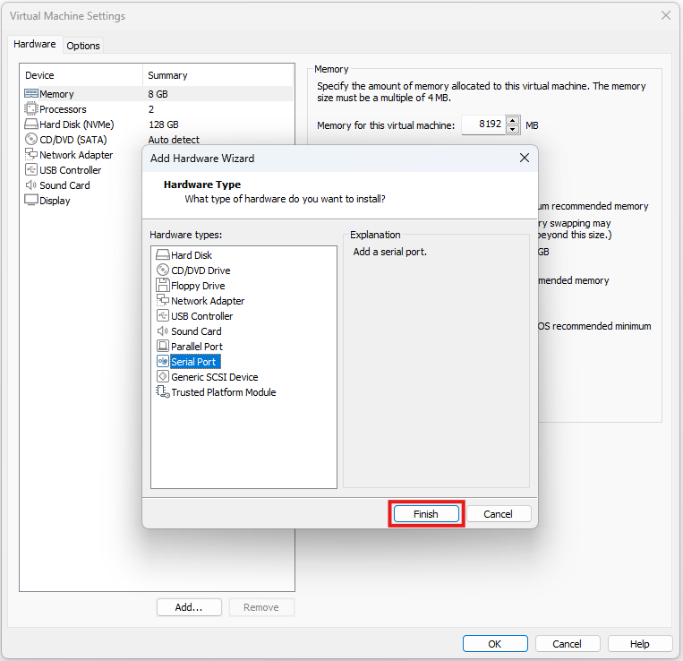
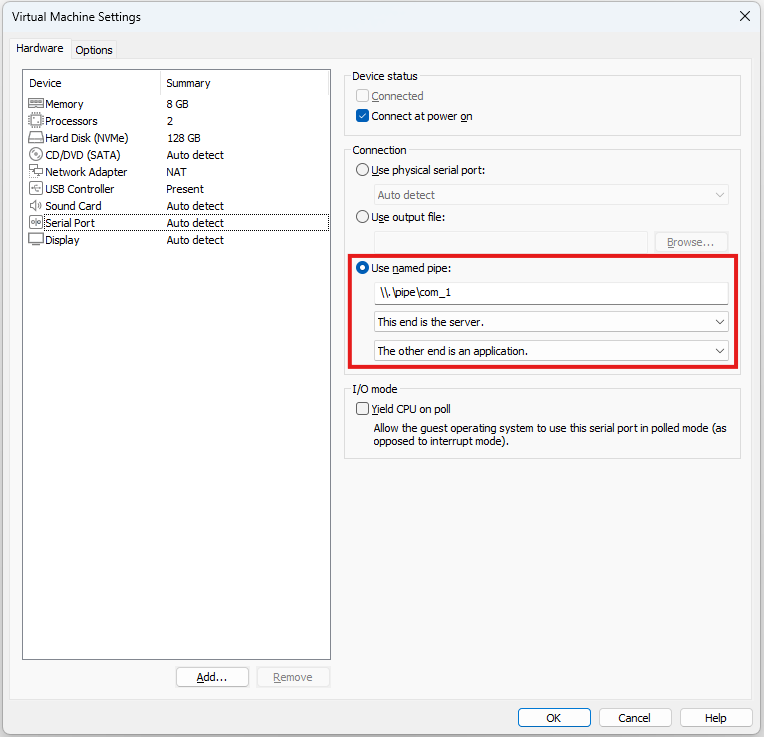

+++
title = "Windows kernel debugging"
date = "2025-04-25"
description = "Windows kernel debugging with WinDbg + VMware"

[taxonomies]
tags = ["tools", "windows kernel", "windbg"]

[extra]
toc_levels = 2
+++

## 0x00. Introduction
This post covers setting up an environment for Windows kernel analysis and documents useful commands.


## 0x01. Setup
### Host (Debugger)
Previously, the setup process was complex with Windows SDK, Virtual KD, etc. for convenience.
Now it's much simpler with the official WinDbg release.
Just install WinDbg from the Microsoft Store and run it.

From the top menu, go to File -> Start Debugging -> Attach to kernel, select COM, and configure as follows:



After completing the configuration and clicking "OK" in the lower right, it enters debugging standby mode.

### Guest (Debuggee)
The debugging target can be set up through various programs. This post describes the configuration method when using VMware.

First, start the target VM, run PowerShell with administrator privileges, and execute these commands:

```
bcdedit /debug on
bcdedit /dbgsettings serial debugport:1 baudrate:115200
```

Then shut down the VM, select VM -> Settings -> Add from the top menu, and add a Serial Port.



Configure the added Serial Port as follows.
Note that selecting "The other end is a virtual machine" instead of "The other end is an application" also seems to work for connection.



Finally, starting the target VM connects it to the host.

## 0x02. Commands
### Modules
#### `lm` (List Modules)
Lists loaded modules or checks information for a specific module.

``` windbg
kd> lm
kd> lm m fltmgr
kd> lm Dvm fltmgr
```

Note that kernel mode regions load at high addresses like `fffff800'00000000`.

#### `x` (eXamine symbols)
Searches symbols or finds specific symbols.

``` windbg
kd> x win32k!
kd> x win32k!vStr*
```

### Symbols
#### `!sym noisy` (Noisy symbol loading)
Displays detailed symbol loading process. Good for debugging loading-related issues.

``` windbg
kd> !sym noisy 
```

#### `!sympath` (Set symbol path)
Sets the path to symbol server or local directory where symbol files are stored.

``` windbg
kd> !sympath SRV*C:\symbols*https://msdl.microsoft.com/download/symbols
kd> !sympath C:\symbols 
```

#### `.reload` (Reload symbols)
Reloads symbols. The `/f` option forces symbol loading.

``` windbg
kd> .reload
kd> .reload /f CLFS
```

### Memory
#### `db` `dw` `dd` `dq` (Display memory)
Displays memory in byte, word, double word, and quad word units respectively.
You can specify the count by adding `L[Length]`, specify range by entering the end address, or use register names to read and use values stored in registers.

``` windbg
kd> db [Address]
kd> dw [Address] L[Length]
kd> dd [Address] [Address]
kd> dq rsp
```

#### `ds` `du` `dc` (Display string)
Displays memory as ASCII and Unicode strings respectively.
`dc` displays both hex values and strings simultaneously.

``` windbg
kd> ds [Address]
kd> du [Address]
```

#### `dps` (Display Pointers and Symbols)
Interprets and displays pointers stored in memory based on symbol information.

``` windbg
kd> dps [Address]
```

#### `u` `ub` `uf` (Unassemble)
Interprets and displays instructions in memory as assembly.
Using basic `u` together with `ub`, which displays assembly code in reverse from the input address, is convenient for viewing instructions before and after at once.

`uf` displays the entire function. You can input any location within the function, not just the beginning. However, symbols must be properly loaded.

``` windbg
kd> u rip
kd> ub rip
kd> uf [Address]
```

### Information
#### `!analyze -v` (Analyze crash dump)
When a crash occurs, it displays various information including the general cause and register states.

``` windbg
kd> !analyze -v
```

#### `k` `kv` (Stack trace)
Displays the current thread's call stack. The `kv` command also displays the values of passed arguments.

``` windbg
kd> k
kd> kv 
```

#### `!process` `!thread` (Process / Thread information)
Displays process information. Using `!process` alone displays detailed information about the current process. Adding `0 0` displays brief information about all processes. To check specific process information, input that process's address.

`!thread` displays thread information. When used alone, it displays current thread information. Inputting a specific thread address displays that thread's information.

``` windbg
kd> !process
kd> !process 0 0
kd> !process [Address]
kd> !thread
kd> !thread [Address]
```

### Debug
#### `bp` `ba` (Break Point)
Stops execution at the specified address or symbol. The `ba` command can stop on read/write/execute operations on specific memory.

``` windbg
kd> bp 0x401000
kd> bp ntdll!NtCreateFile
kd> ba [r/w/x/rw][Length] [Address]
```

#### `p` `t` `pt` `g` `pc` (Flow control)
Various debugging flow control commands exist: `p`(`ni`) executes the next instruction, `t`(`si`) executes the next instruction and steps into functions, `pt` executes until function completion, `g` runs until the next breakpoint, and `pc` runs to a specific address.

``` windbg
kd> p
kd> t
kd> pt
kd> g
kd> pc [Address]
```
